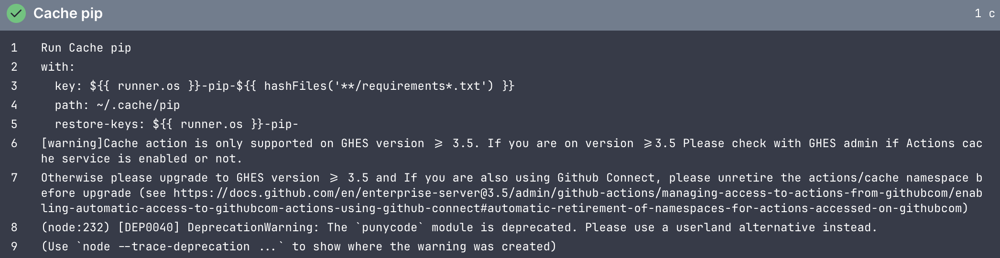

# CI/CD-пайплайн на отечественном сервисе

Требования к реализации:

* разделение на стадии: lint (проверка ссылок и орфографии, сборка в режиме --strict) → build → deploy; 
* кэширование зависимостей с приведением замеров времени сборки без кэша и с кэшем; 
* секреты берутся из хранилища платформы и отсутствуют в репозитории; подтвердить маскирование секретов в логах; 
* воспроизводимость сборки на чистом раннере за счёт зафиксированных версий Python и пакетов; 
* развёртывание выполняется только с основной ветки, для остальных веток выполняется только сборка.


Требования к описанию в отчёте:

* схема пайплайна: стадии, триггеры, артефакты, зависимости между job; 
* перечень событий, запускающих пайплайн, и описание поведения при каждом из них; 
* скриншоты успешного и намеренно проваленного запуска с разбором лога ошибки; 
* бейдж статуса сборки в README; 
* сопоставление с аналогичным workflow на GitHub Actions: что потребовалось изменить (связь с T3).


## GitHub

### Реализация пайлайна


Джобы:

* check-changes - Проверка на изменение файлов, которые отвечают за генерацию изображений для отчета
* generate-data - В случае изменения, генерируются изображения раздичными способами, описанными в [исследовании способов публикации результатов вычислений](t2.md)
* build-test - Билд с проверкой целостности ссылок
* deploy-hosting - Деплой на хостинг
* deploy-gh - Деплой на GitHub Pages

Основной workflow выполнен как последовательность `reusable jobs` со связями и правилами запуска. Такой подход был выполнен для более легкого понимания пайпалйна

## Маскирование секретов


## Замеры по кэшированию

Без кэширования: `~ 52 сек.` на шаг установки всех завсимостей  
С кэшированием: `~ 31 сек.` на шаг установки всех зависимостей

## Намеренно проваленный запуск


## GitVerse

### Реализация пайлпайна 

```
┌──────────────────────────────────────────────────────────────────────┐
│                    ТРИГГЕР: push в любую ветку ('**')                │
└──────────────────────────────────────────────────────────────────────┘
                                  │
                                  ▼
┌──────────────────────────────────────────────────────────────────────┐
│  JOB 1: check-changes                                                │
│  ────────────────────                                                │
│  • Checkout (actions/checkout@v7)                                    │
│  • dorny/paths-filter@v4                                             │
│      фильтр "generator":                                             │
│        - task/docs/scripts/**                                        │
│        - task/docs/t2.md                                             │
│  ─────────────────────────────────────────────────────────────────   │
│  OUTPUT: generator_changed = true/false                              │
└──────────────────────────────────────────────────────────────────────┘
                                  │
                 ┌────────────────┴──────────────────┐
                 │                                   │
                 ▼ (если generator_changed == true)  ▼ (всегда)
┌───────────────────────────────────┐   ┌────────────────────────────────┐
│  JOB 2: generate-data             │   │  JOB 3: build-test             │
│  ────────────────────────         │   │  ─────────────────────         │
│  needs: check-changes             │──▶│  needs: [check-changes,        │
│  permissions: contents: write     │   │          generate-data]        │
│  ────────────────────────         │   │  if: generate-data == success  │
│  • checkout                       │   │      или skipped               │
│  • setup-python 3.14.3            │   │  ─────────────────────         │
│  • cache pip                      │   │  • checkout (ref = gitverse.   │
│  • pip install -r requirements    │   │              ref_name)         │
│  • generate_data.py               │   │  • setup-python 3.14.3         │
│  • jupyter nbconvert (graphics)   │   │  • cache pip                   │
│  • papermill x3 (параметризация)  │   │  • pip install -r requirements │
│  • git commit + push [skip ci]    │   │  • mkdocs build --strict       │
└───────────────────────────────────┘   │  • upload-pages-artifact       │
                                        │    (gitverse-pages, ./task/site)│
                                        └────────────────────────────────┘
                                                        │
                          ┌─────────────────────────────┴──────────────────────┐
                          │                                                    │
                          ▼ (ref == refs/heads/main)                           ▼ (ref == refs/heads/main)
        ┌────────────────────────────────────┐   ┌──────────────────────────────────────┐
        │  JOB 4: deploy-gh                  │   │  JOB 5: deploy-to-helios             │
        │  ──────────────────────            │   │  ──────────────────────              │
        │  needs: build-test                 │   │  needs: build-test                   │
        │  if: build-test == success         │   │  if: build-test == success           │
        │  ──────────────────────            │   │  ──────────────────────              │
        │  • setup-go >=1.23                 │   │  • download-artifact (gitverse-      │
        │  • deploy-pages@v1                 │   │    pages → ./site-artifact)          │
        │    artifact_name: gitverse-pages   │   │  • scp-action@v0.1.7                 │
        │  • print page_url                  │   │    host: HELIOS_HOST                 │
        └────────────────────────────────────┘   │    user: HELIOS_USER                 │
                                                 │    port: 2222                        │
                                                 │    target: ./public_html             │
                                                 └──────────────────────────────────────┘
```

Джобы:

* check-changes - Проверка на изменение файлов, которые отвечают за генерацию изображений для отчета
* generate-data - В случае изменения, генерируются изображения раздичными способами, описанными в [исследовании способов публикации результатов вычислений](t2.md)
* build-test - Билд с проверкой целостности ссылок
* deploy-helios - Деплой в Helios
* deploy-gh - Билд на GitHub Pages


### Замеры по кэшированию

Без кэширования: `~ 75 сек.` на шаг установки всех завсимостей  
С кэшированием: `~ ? сек.` на шаг установки всех зависимостей

#### Проблема при кэшировании




### Отличия в Actions

#### Версии

Многочисленная часть экшнов являются зеркалом на github, также сами версии являются устаревшими:
* actions/deploy-pages@v4 -> actions/deploy-pages@v1
* actions/cache@v3 -> actions/cache@v6

#### Docker

> Облачный раннер в GitVerse не имеет доступа к Docker Daemon, поэтому стандартная команда docker build не работает. Для сборки Docker-образов на облачном раннере используйте kaniko.
> [Источник](https://gitverse.ru/docs/cicd/faq/#как-собрать-docker-образ-на-облачном-раннере)

### Прочие проблемы

Маленький по сравнению с github ресурс на облачные раннеры, тем самым задачи часто висели в ожидании по минут 10-18

## Сравнение

| Критерий / Ресурс | GitVerse (РФ) | GitHub (Международный)                                                                           |
| --- | --- |--------------------------------------------------------------------------------------------------|
| **Доступность в РФ** | Полноценная, без ограничений и VPN. | Ограничена регистрация компаний; платные функции и Copilot из РФ оплатить картой банка РФ нельзя. |
| **Минуты CI/CD в месяц** | 500 мин (приватные) / 1000 мин (публичные). | 2000 мин (только на приватные). На публичные репозитории — бесплатно и без ограничений.          |
| **Макс. время 1 задачи CI/CD** | 30 минут (для облачных раннеров). | 6 часов (360 минут).                                                                             |
| **Свои раннеры (Self-hosted)** | Поддерживаются (бесплатно). | Поддерживаются (бесплатно).                                                                      |
| **Git LFS (крупные файлы)** | 2 ГБ в месяц (хранилище + трафик). | 1 ГБ хранилища и 1 ГБ трафика в месяц.                                                           |
| **Макс. размер файла (HTTP)** | 100 МБ на один файл в коммите. | 100 МБ (рекомендуется до 50 МБ, более 100 МБ блокируется).                                       |
| **Хранилище пакетов (Packages)** | 500 МБ (хранятся бессрочно). | 500 МБ (на приватные репозитории, для публичных — бесплатно).                                    |
| **Артефакты сборки CI/CD** | 500 МБ суммарно, хранятся 30 дней. | Входят в общий объем пакетов репозитория, хранятся 90 дней по умолчанию.                         |
| **Ассеты релизов (Releases)** | 4 ГБ суммарно (до 5 файлов по 100 МБ за раз). | 2 ГБ на один файл (суммарный объем релиза не ограничен).                                         |
| **Лимиты Public API** | 500 запросов в час на IP. | 5000 запросов в час для авторизованных пользователей.                                            |
| **Хостинг сайтов (Pages)** | До 500 МБ, минуты сборки расходуют баланс CI/CD. | До 1 ГБ, сборка бесплатна (ограничение трафика — 100 ГБ/мес).                                    |
| **Интегрированный ИИ** | Встроенный ИИ-ассистент GigaCode (бесплатно). | GitHub Copilot (платно, от $10/мес, требуется иностранная карта).                              |