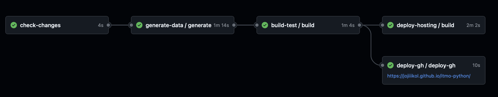
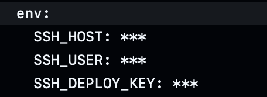
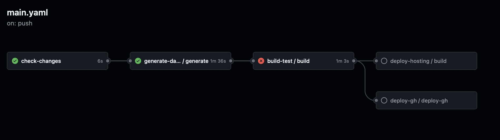

# CI/CD-пайплайн на отечественном сервисе

Требования к реализации:

* разделение на стадии: lint (проверка ссылок и орфографии, сборка в режиме --strict) → build → deploy; 
* кэширование зависимостей с приведением замеров времени сборки без кэша и с кэшем; 
* секреты берутся из хранилища платформы и отсутствуют в репозитории; подтвердить маскирование секретов в логах; 
* воспроизводимость сборки на чистом раннере за счёт зафиксированных версий Python и пакетов; 
* развёртывание выполняется только с основной ветки, для остальных веток выполняется только сборка.

Требования к описанию в отчёте:

* схема пайплайна: стадии, триггеры, артефакты, зависимости между job; 
* перечень событий, запускающих пайплайн, и описание поведения при каждом из них; 
* скриншоты успешного и намеренно проваленного запуска с разбором лога ошибки; 
* бейдж статуса сборки в README; 
* сопоставление с аналогичным workflow на GitHub Actions: что потребовалось изменить (связь с T3).

# GitHub

## Реализация пайлайна

Джобы:
* check-changes - Проверка на изменение файлов, которые отвечают за генерацию изображений для отчета
* generate-data - В случае изменения, генерируются изображения раздичными способами, описанными в [исследовании способов публикации результатов вычислений](t2.md)
* build-test - Билд с проверкой целостности ссылок
* deploy-hosting - Билд на хостинг
* deploy-gh - Билд на GitHub Pages

Основной workflow выполнен как последовательность `reusable jobs` со связями и правилами запуска. Такой подход был выполнен для более легкого понимания пайпалйна

## Маскирование секретов

## Замеры по кэшированию
Без кэширования: `~ 52 сек.` на шаг установки всех завсимостей
С кэшированием: `~ 31 сек.` на шаг установки всех зависимостей

## Намеренно проваленный запуск

