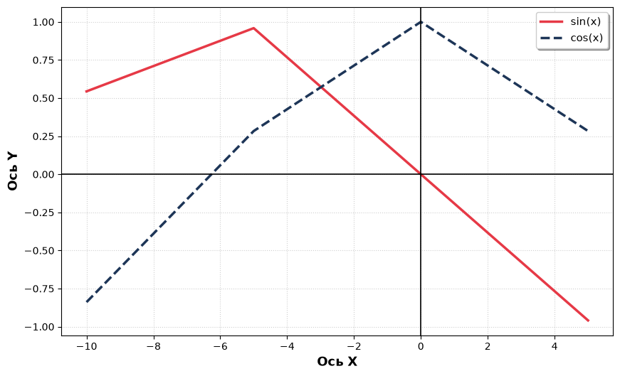

```python
from pathlib import Path
import matplotlib.pyplot as plt
import os
import pandas as pd

PATH = Path(os.getcwd()).parent.parent / "data" / "for_graphics.csv"
SAVE_PATH = Path(os.getcwd()).parent.parent / "docs" / "static" / "images" / "static_notebook.png"


def read_data() -> tuple[list[float], list[float], list[float]]:
    df = pd.read_csv(PATH)
    points_x = df["x"]
    points_y_sin = df["y_sin"]
    points_y_cos = df["y_cos"]
    return points_x, points_y_sin, points_y_cos


def get_graph(points: tuple[list[float], list[float], list[float]]):
    plt.style.use('default')
    fig, ax = plt.subplots(figsize=(10, 6))

    points_x, points_y_sin, points_y_cos = points

    ax.plot(points_x, points_y_sin, color='#e63946', linewidth=2.5, label='sin(x)')
    ax.plot(points_x, points_y_cos, color='#1d3557', linewidth=2.5, label='cos(x)', linestyle='--')

    ax.axhline(0, color='black', linewidth=1.2)
    ax.axvline(0, color='black', linewidth=1.2)

    ax.set_xlabel('Ось X', fontsize=13, fontweight='bold')
    ax.set_ylabel('Ось Y', fontsize=13, fontweight='bold')

    ax.grid(True, linestyle=':', alpha=0.6)

    ax.legend(fontsize=11, loc='upper right', frameon=True,
              shadow=True, fancybox=True)

    plt.savefig(SAVE_PATH)
    plt.show()


points_x, points_y_sin, points_y_cos = read_data()
get_graph((points_x, points_y_sin, points_y_cos))
```


    

    

