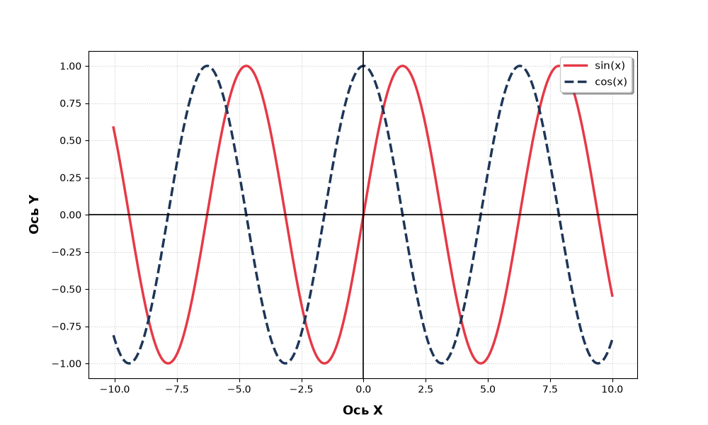

# Исследование способов публикации результатов вычислений на страницах сайта


Целью исследования является сравнение различных способов публикации результатов вычислений на статических страницах сайта.

Рассматриваются следующие подходы:

* статические изображения, подготовленные вручную;
* `nbconvert`;
* `mkdocs-jupyter`;
* `MyST-NB`;
* `Quarto`;
* `Papermill` с параметризацией запусков;
* генерация Markdown и CSV отдельным Python-скриптом, вызываемым через `Makefile` или `nox`.


# Статические изображения

## Общий принцип

В данном подходе вычисления выполняются отдельно от процесса сборки сайта. Полученный результат сохраняется в виде изображения и добавляется в проект как обычный статический ресурс.

## Реализация

Ход выполнения:

1. Получение исходных данных.
2. Выполнение вычислений.
3. Формирование изображения.
4. Сохранение изображения в проект.
5. Добавление ссылки на изображение в Markdown.
6. Сборка сайта.

## Результат



## Особенности

Основной особенностью является отсутствие связи между исходным кодом вычислений и результатом после добавления изображения в проект.

Например, если исходные данные изменились, существующий файл `static.png` автоматически не изменяется.

Таким образом, актуализация результата является отдельной ручной операцией.

## Достоинства и недостатки

| Достоинства                                   | Недостатки                                              |
| --------------------------------------------- | ------------------------------------------------------- |
| Простая реализация                            | Ручное обновление результатов                           |
| Точный контроль над итоговым изображением     | Риск потери актуальности результатов                    |
| Не требуется выполнение вычислений при сборке | Результат не связан с исходным кодом                    |
| Минимальное количество зависимостей           | Плохо подходит для большого количества вычислений       |
| Быстрая сборка сайта                          | Сложно автоматизировать массовое обновление результатов |


# nbconvert
`nbconvert` — инструмент экосистемы Jupyter, предназначенный для преобразования Jupyter Notebook (`.ipynb`) в различные форматы.

В отличие от статических изображений, notebook может содержать как исходный код, так и полученные в результате его выполнения таблицы, графики и текстовые результаты.

## Реализация

Ход выполнения:

1. Получение исходных данных.
2. Подготовка Jupyter Notebook.
3. Выполнение notebook.
4. Сохранение полученных результатов.
5. Преобразование notebook в требуемый формат.
6. Использование полученного результата при сборке сайта.

Например:

```bash
jupyter nbconvert \
    --execute \
    --to markdown \
    scripts/graphics.ipynb
```

## Результат


## Особенности

Важное отличие от статического изображения заключается в том, что результат может быть получен непосредственно из исходного notebook.

При изменении исходного кода notebook его можно повторно выполнить и получить обновлённый результат.

Однако сам `nbconvert` не является полноценной системой управления процессом сборки сайта. Необходимо самостоятельно определить:

* когда выполнять notebook;
* какие notebook выполнять;
* куда сохранять результаты;
* какие зависимости установить;
* в каком порядке выполнять операции.

## Достоинства и недостатки

| Достоинства                                         | Недостатки                                                               |
| --------------------------------------------------- | ------------------------------------------------------------------------ |
| Автоматическое выполнение и преобразование notebook | Необходимо самостоятельно организовывать pipeline                        |
| Поддержка множества форматов                        | Для большого количества notebook необходимо управлять множеством вызовов |
| Прямая интеграция с Jupyter                         | Выполнение notebook увеличивает время сборки                             |
| Результаты связаны с исходным кодом                 | Требуется корректно настроенное Python/Jupyter-окружение                 |
| Подходит для CI/CD                                  | Параметризация не является основной функцией инструмента                 |


# mkdocs-jupyter

`mkdocs-jupyter` — плагин для MkDocs, позволяющий использовать Jupyter Notebook непосредственно в качестве источника страниц документации.

В отличие от ручного вызова `nbconvert`, выполнение notebook интегрируется непосредственно в процесс сборки сайта.

## Реализация

Ход выполнения:

1. Получение исходных данных.
2. Размещение notebook в каталоге документации.
3. Запуск `mkdocs build`.
4. Плагин обрабатывает notebook.
5. Код notebook выполняется.
6. Полученные outputs преобразуются в страницу.
7. Страница включается в итоговый сайт.

Таким образом, отдельная команда `nbconvert` для каждого notebook не требуется.


## Результат

[Ссылка на сгенерированную страницу ](scripts/graphics.ipynb)

## Достоинства и недостатки

| Достоинства                              | Недостатки                                                       |
| ---------------------------------------- | ---------------------------------------------------------------- |
| Интеграция с MkDocs                      | Зависимость от MkDocs и плагина                                  |
| Автоматическое выполнение при сборке     | Выполнение notebook увеличивает время сборки                     |
| Не требуется отдельный этап `nbconvert`  | Требуется Python/Jupyter-окружение                               |
| Удобно добавлять notebook в документацию | Необходим контроль зависимостей                                  |
| Подходит для технической документации    | Большое количество вычислений может существенно замедлить сборку |

# MyST-NB

MyST-NB — инструмент для использования исполняемых Jupyter Notebook и кодовых блоков в экосистеме MyST/Sphinx.

## Реализация

Ход выполнения:

1. Получение исходных данных.
2. Подготовка Markdown-документа или notebook.
3. Запуск сборки документации.
4. MyST-NB обнаруживает исполняемые блоки.
5. Код выполняется.
6. Полученные результаты добавляются в документацию.
7. Sphinx формирует итоговые HTML-страницы.


## Достоинства и недостатки

| Достоинства                                         | Недостатки                                                   |
| --------------------------------------------------- | ------------------------------------------------------------ |
| Тесная интеграция с Sphinx                          | Дополнительная зависимость от Sphinx/MyST                    |
| Markdown и notebooks могут использоваться совместно | Более сложная конфигурация                                   |
| Вычисления являются частью сборки документации      | Выполнение увеличивает время сборки                          |
| Подходит для научной и технической документации     | Требуется Python-окружение с необходимыми зависимостями      |
| Можно контролировать процесс выполнения             | Для простого сайта инфраструктура может оказаться избыточной |


# Quarto

Quarto — система публикации документов, ориентированная на создание документов и сайтов, содержащих текст, код и результаты вычислений.

## Реализация

Ход выполнения:

1. Получение исходных данных.
2. Подготовка `.qmd` или `.ipynb`.
3. Запуск команды сборки Quarto.
4. Выполнение вычислительных блоков.
5. Формирование графиков и таблиц.
6. Формирование HTML.
7. Размещение результата на сайте.

## Особенность подхода

Quarto объединяет несколько этапов:

   1. документ 
   2. вычисления 
   3. рендеринг 
   4. публикация

Поэтому отдельная связка из notebook renderer и генератора документации во многих сценариях не требуется.

## Достоинства и недостатки

| Достоинства                                 | Недостатки                                                |
| ------------------------------------------- | --------------------------------------------------------- |
| Интеграция вычислений и публикации          | Дополнительная система в проекте                          |
| Поддержка Jupyter Notebook                  | Увеличение сложности инфраструктуры                       |
| Поддержка Markdown-подобного формата `.qmd` | Выполнение кода увеличивает время сборки                  |
| Автоматическая генерация таблиц и графиков  | Необходимость настройки окружения                         |
| Подходит для воспроизводимых отчётов        | Для небольших проектов возможности могут быть избыточными |


# Papermill

Papermill предназначен для параметризованного выполнения Jupyter Notebook.

В отличие от предыдущих инструментов, его основная задача заключается в запуске одного notebook с различными наборами входных параметров.

## Общий принцип

Например, notebook может содержать:

```python
YEAR = 2026
REGION = "Moscow"
```

После чего Papermill позволяет выполнить его с другими параметрами.

Пример:

```bash
papermill \
    scripts/graphics.ipynb \
    output/graphics.ipynb \
    -p YEAR 2026 \
    -p REGION Moscow
```

## Реализация

Ход выполнения:

1. Получение исходных данных.
2. Подготовка параметризованного notebook.
3. Передача параметров Papermill.
4. Выполнение notebook.
5. Получение нового выполненного notebook.
6. Преобразование результата в формат сайта.
7. Добавление результата в сайт.

Таким образом, Papermill обычно используется совместно с другим инструментом.

## Результат
[Параметризация: 1](scripts/parametrize_graphics_1.ipynb)  
[Параметризация: 2](scripts/parametrize_graphics_2.ipynb)  
[Параметризация: 3](scripts/parametrize_graphics_3.ipynb)

## Достоинства и недостатки

| Достоинства                                     | Недостатки                                                   |
| ----------------------------------------------- | ------------------------------------------------------------ |
| Удобная параметризация notebook                 | Не является генератором сайта                                |
| Один notebook можно использовать многократно    | Требует дополнительного этапа публикации                     |
| Подходит для массовых запусков                  | Количество вычислений растёт вместе с количеством параметров |
| Хорошо подходит для автоматизированных pipeline | Необходим контроль получаемых notebook                       |
| Можно интегрировать в CI/CD                     | Увеличивается сложность pipeline                             |


# Генерация Markdown и CSV отдельным Python-скриптом

Данный подход предполагает разделение вычислительной части и представления результатов.

Вместо выполнения notebook во время генерации страницы создаётся отдельный Python-скрипт.

## Реализация

Python-скрипт выполняет вычисления и сохраняет результаты:

```python
import pandas as pd

def main():
    # вычисления
    ...

    df = pd.DataFrame(...)

    df.to_csv(
        "data/result.csv",
        index=False,
    )

    with open("docs/result.md", "w") as file:
        file.write(...)


if __name__ == "__main__":
    main()
```

Makefile

```makefile
generate:
	python scripts/generate_data.py

build: generate
	mkdocs build
```

Вместо `Makefile` аналогичная задача может быть реализована с помощью `nox`.

## Преимущество разделения вычислений и представления

В данном случае вычислительный код не зависит от конкретного генератора сайта.
Один и тот же генератор данных может использоваться несколькими системами публикации.

## Достоинства и недостатки

| Достоинства                                  | Недостатки                                                 |
| -------------------------------------------- | ---------------------------------------------------------- |
| Чёткое разделение вычислений и представления | Необходимо самостоятельно проектировать формат результатов |
| Полный контроль над pipeline                 | Требуется отдельный Python-скрипт                          |
| Хорошая интеграция с CI/CD                   | Необходима настройка Makefile/Nox                          |
| Не зависит от Jupyter                        | Нужно самостоятельно реализовать генерацию Markdown        |
| Удобно тестировать вычислительную часть      | Отсутствует интерактивность notebook                       |
| Удобно работать с большими объёмами данных   | Дополнительный код для форматирования результатов          |
