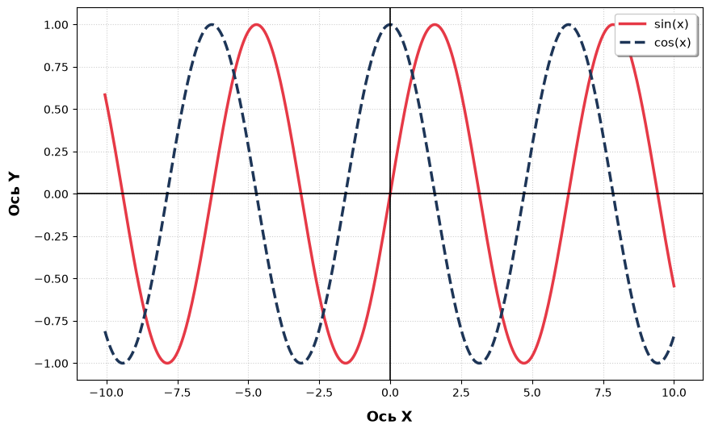

# T2. Анализ конвейера «эксперимент → артефакт → страница»
В данном задании исследуются следующие варианты попадания результатов вычисления:
* статические изображения, сохранённые вручную (базовый вариант для сравнения); 
* `nbconvert`, `MyST-NB`, `Quarto` — исполнение ноутбуков на этапе сборки; 
* `papermill` с параметризацией запусков; 
* генерация Markdown и CSV отдельным скриптом, вызываемым из `Makefile` или `nox` перед сборкой сайта.

## Статические изображения
### Реализация
Ход:
1) Получение изображения
2) Добавление в проект
3) Добавление ссылки на изображение
### Результат

## nbconvert
### Реализация
Ход:
1) Получение данных
2) Исполнение notebook путем инструмента nbconvert
3) Пример: `jupyter nbconvert --to markdown <ПУТЬ_СОХРАНЕНИЯ>`
### Результат

## mkdocs-jupyter
### Реализация
### Результат
[Ссылка на ipynb](scripts/graphics.ipynb)

