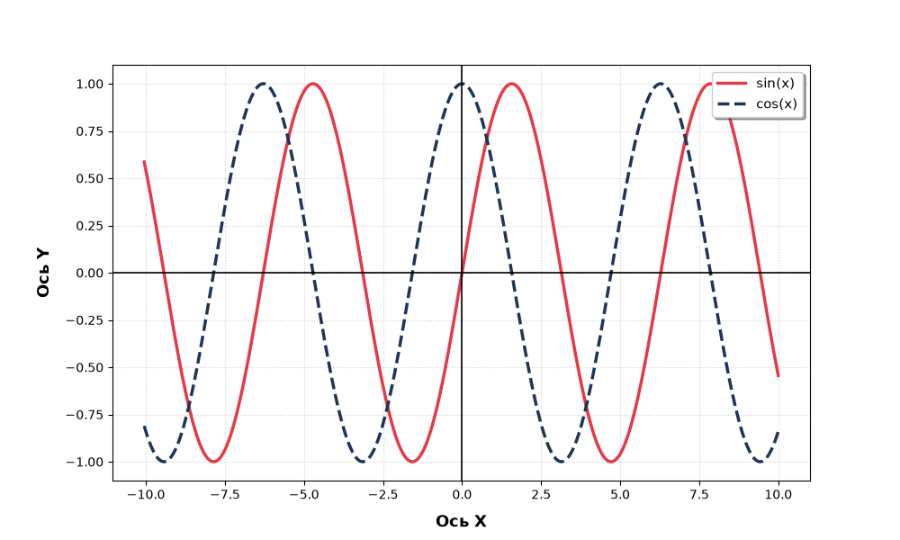
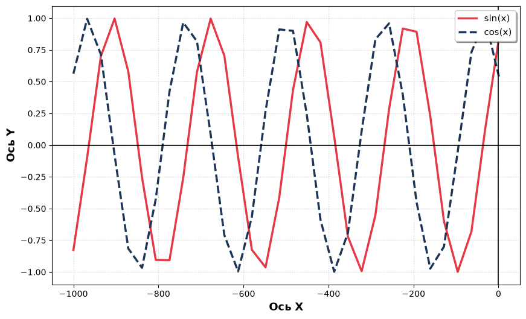

# Исследование способов публикации результатов вычислений на страницах сайта


Целью исследования является сравнение различных способов публикации результатов вычислений на статических страницах сайта.

Рассматриваются следующие подходы:

* статические изображения, подготовленные вручную;
* `nbconvert`;
* `mkdocs-jupyter`;
* `MyST-NB`;
* `Quarto`;
* `Papermill` с параметризацией запусков;
* генерация Markdown и CSV отдельным Python-скриптом, вызываемым через `Makefile` или `nox`.

Первые шесть пунктов включают несколько вариантов исполнения ноутбуков; последний вариант рассматривается как отдельный производственный конвейер. Основной критерий выбора — не только удобство, но и воспроизводимость: можно ли по опубликованной странице понять, каким кодом, данными и параметрами получен результат.


## Статические изображения

### Общий принцип

В данном подходе вычисления выполняются отдельно от процесса сборки сайта. Полученный результат сохраняется в виде изображения и добавляется в проект как обычный статический ресурс.

Исследователь запускает код локально, сохраняет результат, например `figure-1.png`, и вручную добавляет его в `docs/assets/`:

```text
docs/
  experiment.md
  assets/
    figure-1.png
```

### Реализация

Ход выполнения:

1. Получение исходных данных.
2. Выполнение вычислений.
3. Формирование изображения.
4. Сохранение изображения в проект.
5. Добавление ссылки на изображение в Markdown.
6. Сборка сайта.

### Результат



### Особенности

Основной особенностью является отсутствие связи между исходным кодом вычислений и результатом после добавления изображения в проект.

Например, если исходные данные изменились, существующий файл `static.png` автоматически не изменяется.

Таким образом, актуализация результата является отдельной ручной операцией.

### Достоинства и недостатки

| Достоинства                                   | Недостатки                                              |
| --------------------------------------------- | ------------------------------------------------------- |
| Простая реализация                            | Ручное обновление результатов                           |
| Точный контроль над итоговым изображением     | Риск потери актуальности результатов                    |
| Не требуется выполнение вычислений при сборке | Результат не связан с исходным кодом                    |
| Минимальное количество зависимостей           | Плохо подходит для большого количества вычислений       |
| Быстрая сборка сайта                          | Сложно автоматизировать массовое обновление результатов |


Это хороший базовый вариант для сравнения и приемлемый финальный вариант для тяжёлых вычислений, если рядом публикуются метаданные запуска.


## nbconvert
`nbconvert` — инструмент экосистемы Jupyter, предназначенный для преобразования Jupyter Notebook (`.ipynb`) в различные форматы.

В отличие от статических изображений, notebook может содержать как исходный код, так и полученные в результате его выполнения таблицы, графики и текстовые результаты.

Важно различать два режима:
1. **конвертация готового notebook** — код не запускается, а только преобразуется уже сохранённый результат;
2. **execute + convert** — notebook сначала запускается, затем преобразуется.

### Реализация

Ход выполнения:

1. Получение исходных данных.
2. Подготовка Jupyter Notebook.
3. Выполнение notebook.
4. Сохранение полученных результатов.
5. Преобразование notebook в требуемый формат.
6. Использование полученного результата при сборке сайта.

Например:

```bash
jupyter nbconvert \
    --execute \
    --to markdown \
    scripts/graphics.ipynb
```

### Результат



### Особенности

Важное отличие от статического изображения заключается в том, что результат может быть получен непосредственно из исходного notebook.

При изменении исходного кода notebook его можно повторно выполнить и получить обновлённый результат.

Однако сам `nbconvert` не является полноценной системой управления процессом сборки сайта. Необходимо самостоятельно определить:

* когда выполнять notebook;
* какие notebook выполнять;
* куда сохранять результаты;
* какие зависимости установить;
* в каком порядке выполнять операции.

### Достоинства и недостатки

| Достоинства                                         | Недостатки                                                               |
| --------------------------------------------------- | ------------------------------------------------------------------------ |
| Автоматическое выполнение и преобразование notebook | Необходимо самостоятельно организовывать pipeline                        |
| Поддержка множества форматов                        | Для большого количества notebook необходимо управлять множеством вызовов |
| Прямая интеграция с Jupyter                         | Выполнение notebook увеличивает время сборки                             |
| Результаты связаны с исходным кодом                 | Требуется корректно настроенное Python/Jupyter-окружение                 |
| Подходит для CI/CD                                  | Параметризация не является основной функцией инструмента                 |


## mkdocs-jupyter

`mkdocs-jupyter` — плагин для MkDocs, позволяющий использовать Jupyter Notebook непосредственно в качестве источника страниц документации.

В отличие от ручного вызова `nbconvert`, выполнение notebook интегрируется непосредственно в процесс сборки сайта.

### Реализация

Ход выполнения:

1. Получение исходных данных.
2. Размещение notebook в каталоге документации.
3. Запуск `mkdocs build`.
4. Плагин обрабатывает notebook.
5. Код notebook выполняется.
6. Полученные outputs преобразуются в страницу.
7. Страница включается в итоговый сайт.

Таким образом, отдельная команда `nbconvert` для каждого notebook не требуется.


### Результат

[Ссылка на сгенерированную страницу ](scripts/graphics.ipynb)

### Достоинства и недостатки

| Достоинства                              | Недостатки                                                       |
| ---------------------------------------- | ---------------------------------------------------------------- |
| Интеграция с MkDocs                      | Зависимость от MkDocs и плагина                                  |
| Автоматическое выполнение при сборке     | Выполнение notebook увеличивает время сборки                     |
| Не требуется отдельный этап `nbconvert`  | Требуется Python/Jupyter-окружение                               |
| Удобно добавлять notebook в документацию | Необходим контроль зависимостей                                  |
| Подходит для технической документации    | Большое количество вычислений может существенно замедлить сборку |

## MyST-NB

MyST-NB — расширение экосистемы Sphinx/MyST, которое позволяет включать Jupyter Notebook и executable Markdown в документацию Sphinx. Оно сохраняет сильные стороны Sphinx: директивы, cross-references, builder-ы, API-документацию и темы.


Типовая схема:

```text
.ipynb / .md
    |
    v
MyST-NB + Sphinx
    |
    +--> выполнение ячеек
    +--> кэш выполнения
    +--> HTML / LaTeX / PDF
```
### Реализация

Ход выполнения:

1. Получение исходных данных.
2. Подготовка Markdown-документа или notebook.
3. Запуск сборки документации.
4. MyST-NB обнаруживает исполняемые блоки.
5. Код выполняется.
6. Полученные результаты добавляются в документацию.
7. Sphinx формирует итоговые HTML-страницы.


### Достоинства и недостатки

| Достоинства                                         | Недостатки                                                   |
| --------------------------------------------------- | ------------------------------------------------------------ |
| Тесная интеграция с Sphinx                          | Дополнительная зависимость от Sphinx/MyST                    |
| Markdown и notebooks могут использоваться совместно | Более сложная конфигурация                                   |
| Вычисления являются частью сборки документации      | Выполнение увеличивает время сборки                          |
| Подходит для научной и технической документации     | Требуется Python-окружение с необходимыми зависимостями      |
| Можно контролировать процесс выполнения             | Для простого сайта инфраструктура может оказаться избыточной |


## Quarto

Quarto — издательская система для научных и технических материалов. Исходником может быть `.qmd` или notebook. Внутри документа размещаются текст, формулы, code cells, параметры, ссылки на figures/tables и citations.

Пример запуска:

```bash
quarto render report.qmd --output-dir site-generated
```
### Реализация

Ход выполнения:

1. Получение исходных данных.
2. Подготовка `.qmd` или `.ipynb`.
3. Запуск команды сборки Quarto.
4. Выполнение вычислительных блоков.
5. Формирование графиков и таблиц.
6. Формирование HTML.
7. Размещение результата на сайте.

### Особенность подхода

Quarto объединяет несколько этапов:

   1. документ 
   2. вычисления 
   3. рендеринг 
   4. публикация

Поэтому отдельная связка из notebook renderer и генератора документации во многих сценариях не требуется.

### Достоинства и недостатки

| Достоинства                                 | Недостатки                                                |
| ------------------------------------------- | --------------------------------------------------------- |
| Интеграция вычислений и публикации          | Дополнительная система в проекте                          |
| Поддержка Jupyter Notebook                  | Увеличение сложности инфраструктуры                       |
| Поддержка Markdown-подобного формата `.qmd` | Выполнение кода увеличивает время сборки                  |
| Автоматическая генерация таблиц и графиков  | Необходимость настройки окружения                         |
| Подходит для воспроизводимых отчётов        | Для небольших проектов возможности могут быть избыточными |


## Papermill

Papermill предназначен для параметризованного выполнения Jupyter Notebook.

В отличие от предыдущих инструментов, его основная задача заключается в запуске одного notebook с различными наборами входных параметров.

### Общий принцип

Например, notebook может содержать:

```python
YEAR = 2026
REGION = "Moscow"
```

После чего Papermill позволяет выполнить его с другими параметрами.

Пример:

```bash
papermill \
    scripts/graphics.ipynb \
    output/graphics.ipynb \
    -p YEAR 2026 \
    -p REGION Moscow
```

### Реализация

Ход выполнения:

1. Получение исходных данных.
2. Подготовка параметризованного notebook.
3. Передача параметров Papermill.
4. Выполнение notebook.
5. Получение нового выполненного notebook.
6. Преобразование результата в формат сайта.
7. Добавление результата в сайт.

Таким образом, Papermill обычно используется совместно с другим инструментом.

### Результат
[Параметризация: 1](scripts/parametrize_graphics_1.ipynb)  
[Параметризация: 2](scripts/parametrize_graphics_2.ipynb)  
[Параметризация: 3](scripts/parametrize_graphics_3.ipynb)

### Достоинства и недостатки

| Достоинства                                     | Недостатки                                                   |
| ----------------------------------------------- | ------------------------------------------------------------ |
| Удобная параметризация notebook                 | Не является генератором сайта                                |
| Один notebook можно использовать многократно    | Требует дополнительного этапа публикации                     |
| Подходит для массовых запусков                  | Количество вычислений растёт вместе с количеством параметров |
| Хорошо подходит для автоматизированных pipeline | Необходим контроль получаемых notebook                       |
| Можно интегрировать в CI/CD                     | Увеличивается сложность pipeline                             |


## Генерация Markdown и CSV отдельным Python-скриптом

Данный подход предполагает разделение вычислительной части и представления результатов.

Вместо выполнения notebook во время генерации страницы создаётся отдельный Python-скрипт.

```text
scripts/run_experiment.py
        |
        +--> docs/generated/results.md
        +--> docs/generated/results.csv
        +--> docs/generated/metadata.json
        |
        v
python -m mkdocs build --strict
```

### Вариант с `Makefile`

```make
.PHONY: results site clean

results:
	python scripts/run_experiment.py \
		--data data/input.csv \
		--markdown docs/generated/results.md \
		--csv docs/generated/results.csv \
		--metadata docs/generated/metadata.json

site: results
	python -m mkdocs build --strict

clean:
	rm -rf site docs/generated
```

Запуск:

```bash
make site
```

### Вариант с `nox`

```python
import nox

@nox.session
def site(session):
    session.install("-r", "requirements.txt")
    session.run("python", "scripts/run_experiment.py")
    session.run("python", "-m", "mkdocs", "build", "--strict")
```
### Реализация

Python-скрипт выполняет вычисления и сохраняет результаты:

```python
import pandas as pd

def main():
    # вычисления
    ...

    df = pd.DataFrame(...)

    df.to_csv(
        "data/result.csv",
        index=False,
    )

    with open("docs/result.md", "w") as file:
        file.write(...)


if __name__ == "__main__":
    main()
```

Makefile

```makefile
generate:
	python scripts/generate_data.py

build: generate
	mkdocs build
```

Вместо `Makefile` аналогичная задача может быть реализована с помощью `nox`.

### Преимущество разделения вычислений и представления

В данном случае вычислительный код не зависит от конкретного генератора сайта.
Один и тот же генератор данных может использоваться несколькими системами публикации.

### Достоинства и недостатки

| Достоинства                                  | Недостатки                                                 |
| -------------------------------------------- | ---------------------------------------------------------- |
| Чёткое разделение вычислений и представления | Необходимо самостоятельно проектировать формат результатов |
| Полный контроль над pipeline                 | Требуется отдельный Python-скрипт                          |
| Хорошая интеграция с CI/CD                   | Необходима настройка Makefile/Nox                          |
| Не зависит от Jupyter                        | Нужно самостоятельно реализовать генерацию Markdown        |
| Удобно тестировать вычислительную часть      | Отсутствует интерактивность notebook                       |
| Удобно работать с большими объёмами данных   | Дополнительный код для форматирования результатов          |


## Ограничения CI для тяжёлых вычислений

| Ограничение | Практический эффект | Мера контроля |
| --- | --- | --- |
| Лимит минут CI | Длинный notebook или серия `papermill` может исчерпать quota | Таймауты на шаг, профилирование, кэш, перенос вычислений на отдельный runner |
| Таймаут job/step | Зависший процесс блокирует workflow | Явный timeout, checkpoint, сохранение промежуточных результатов |
| Нет GPU или специального ускорителя | CUDA/ROCm-эксперимент не запустится на обычном runner | Self-hosted runner или внешний вычислительный сервис |
| Ограниченная RAM/CPU | OOM, swap и нестабильное время сборки | Уменьшение batch size, предварительное вычисление, отдельная машина |
| Ограниченный кэш | Кэш пакетов и outputs может быть удалён или переполнен | Кэшировать зависимости, но не полагаться на кэш как на единственное хранилище |
| Размер artifact/repository | Большие notebooks, модели и HTML медленно загружаются | Сжимать outputs, хранить данные отдельно, публиковать агрегаты |
| Секреты и доступ к данным | Fork/PR не должен получать закрытые credentials | Разделять build и deploy, использовать Secrets/Environments |
| Нестабильная сеть | Загрузка модели или dataset ломает воспроизводимость | Фиксировать версии, использовать зеркало/registry, проверять checksum |
| Параллельные запуски | Несколько workflow могут перезаписать один результат | `concurrency`, уникальный run id, атомарная публикация |
| Непредсказуемая среда | Обновление Python/пакета меняет результат | Lock-файл, pinned dependencies, container или фиксированный runner |

Конкретные лимиты GitHub Actions зависят от типа аккаунта, runner и настроек организации. Поэтому в проекте нельзя считать CI бесконечным вычислительным кластером. Даже если конкретный запуск проходит, рост числа данных или параметров может сделать pipeline непригодным.

## Граница между двумя стратегиями

### Вычисления выполняются в CI

Эту стратегию следует выбирать, если:

- запуск длится недолго и укладывается в установленный timeout;
- зависимости доступны из публичного PyPI/registry;
- данные небольшие, стабильные и не требуют GPU;
- результат должен автоматически обновляться при каждом изменении кода;
- вычисление детерминировано или случайность фиксируется seed;
- failed computation должен блокировать публикацию устаревшей страницы.

Плюс — сильная автоматическая проверка связи «код → результат → сайт». Минус — публикация становится зависимой от времени, ресурсов и состояния внешней CI-среды.

### Вычисления выполняются отдельно, CI публикует готовые артефакты

Эта стратегия предпочтительна, если:

- расчёт длится дольше разумного CI timeout;
- нужен GPU, большой объём RAM или закрытая сеть;
- запускается много параметров и нужен scheduler;
- dataset или модель слишком велики для repository/artifact;
- результат должен быть опубликован только после ручной проверки;
- важна стабильная публикация даже при недоступности вычислительной машины.

В этом случае CI проверяет структуру и метаданные, забирает утверждённые outputs из artifact storage или отдельной ветки и собирает сайт. CI не должен молча пересчитывать результат при каждом push.

### Практическая граница

Для учебного проекта разумно использовать правило:

```text
если полный pipeline стабильно работает менее 5–10 минут,
не требует GPU и создаёт небольшой output -> можно выполнять в CI;
иначе вычислять отдельно, а в CI публиковать зафиксированный артефакт.
```

Порог не является универсальным лимитом. Это инженерное правило, оставляющее запас на установку зависимостей, очередь runner и повторный запуск.

### Связь результата с кодом и данными

При второй стратегии нельзя публиковать только `figure.png`. Минимальный комплект артефакта должен содержать:

```text
release/experiment-2026-09-22/
  results.md
  results.csv
  figure-01.png
  metadata.json
  environment.txt
```

Пример `metadata.json`:

```json
{
  "experiment": "baseline-classifier",
  "run_id": "2026-09-22T12:00:00Z-42",
  "code": {
    "repository": "https://github.com/L1oneSs/project-python",
    "commit": "<git-commit-sha>",
    "script": "scripts/run_experiment.py"
  },
  "data": {
    "name": "dataset-v3",
    "version": "2026-09-20",
    "sha256": "<dataset-sha256>",
    "source": "<dataset-url-or-storage-id>"
  },
  "parameters": {
    "seed": 42,
    "test_size": 0.2
  },
  "environment": {
    "python": "3.13.5",
    "platform": "linux-x86_64",
    "requirements_sha256": "<lock-file-sha256>"
  },
  "outputs": {
    "results_csv_sha256": "<output-sha256>",
    "figure_sha256": "<figure-sha256>"
  },
  "created_at": "2026-09-22T12:05:00Z"
}
```

В самой опубликованной странице нужно показывать хотя бы:

- короткий `run_id`;
- commit SHA или ссылку на commit;
- название и версию dataset;
- параметры запуска;
- дату и версию окружения;
- ссылку на исходный notebook/script;

#### Защита от несогласованных артефактов

Перед публикацией полезно выполнить проверки:

```bash
test -f docs/generated/results.md
test -f docs/generated/results.csv
test -f docs/generated/metadata.json
python scripts/verify_metadata.py docs/generated/metadata.json
python -m mkdocs build --strict
```

`verify_metadata.py` должен проверять наличие commit SHA, dataset version, parameters, timestamp и checksums. Если метаданные не соответствуют коду или отсутствует обязательный output, workflow должен завершиться ошибкой.

### Итог

Граница между стратегиями проходит по стоимости и требованиям к воспроизводимости вычисления. `nbconvert`, MyST-NB и Quarto удобны, когда notebook можно безопасно выполнять при сборке. `papermill` лучше подходит для параметрических серий, а связка скрипт + `Makefile`/`nox` лучше всего отделяет вычислительный этап от публикационного.

Для коротких, детерминированных и малых экспериментов вычисление в CI даёт максимальную автоматическую проверку. Для тяжёлых или специализированных расчётов следует выполнять эксперимент отдельно, сохранять outputs с commit SHA, версиями данных, параметрами, окружением и checksum, а CI использовать для валидации и публикации готового артефакта.
